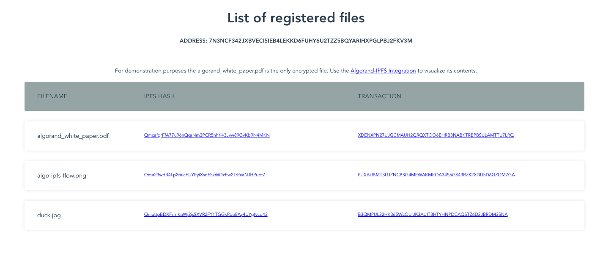
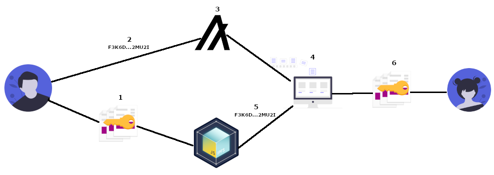

# Algorand-IPFS

> Secure file sharing built on **Algorand** and **IPFS**: client-side AES-256 encryption, content-addressed storage, and an on-chain index built from 0-Algo note transactions — no smart contract required.

[](https://nodejs.org)
[](https://github.com/algorand/js-algorand-sdk)
[](https://docs.ipfs.tech/reference/kubo/rpc/)
[](https://algonode.io)
[](https://nodejs.org/api/crypto.html)
[](https://algo-ipfs.surge.sh)
[](./LICENSE)



**Live demo:** [https://algo-ipfs.surge.sh/](https://algo-ipfs.surge.sh/) — a public block explorer view of the indexed files written by this CLI. Click any row to view the underlying 0-Algo Algorand transaction on Lora.

**Why this exists.** I built the first cut of this in 2020 after reading a Medium walkthrough on combining blockchain with content-addressed storage, and it has quietly become my most-starred public repo. I returned to it in 2026 to bring it back from the dead — PureStake was decommissioned, `algosdk` jumped a major version, and the `ipfs` npm package was deprecated. The modernization (see [2026 modernization notes](#2026-modernization-notes)) doubles as a worked example of maintaining a small system across a 6-year gap.

---

## Table of contents

- [At a glance](#at-a-glance)
- [Architecture](#architecture)
- [What this demonstrates](#what-this-demonstrates)
- [Quick start](#quick-start)
- [CLI usage](#cli-usage)
- [Configuration](#configuration)
- [Security considerations](#security-considerations)
- [2026 modernization notes](#2026-modernization-notes)
- [Repository structure](#repository-structure)
- [Credits & inspiration](#credits--inspiration)
- [License](#license)

---

## At a glance

| Layer            | Choice                                                                          | Why                                                                                                  |
| ---------------- | ------------------------------------------------------------------------------- | ---------------------------------------------------------------------------------------------------- |
| Blockchain       | [Algorand](https://algorand.co) via [`algosdk` v2](https://github.com/algorand/js-algorand-sdk) | Fast finality, cheap (0.001 ALGO min fee), and the 1 KB transaction note is enough for a CID + name. |
| Algorand API     | [AlgoNode](https://algonode.io) public endpoints                                | Free, no API key, no signup — survives PureStake's 2022 sunset.                                      |
| Storage          | [IPFS / Kubo HTTP RPC API](https://docs.ipfs.tech/reference/kubo/rpc/)          | Content addressing means the on-chain hash is also an integrity proof.                               |
| Encryption       | Node `crypto` — **AES-256-CBC** with a fresh 16-byte IV per file                | Confidentiality lives in the client, not the storage layer.                                          |
| CLI              | Node 18+ (built-in `fetch`, `FormData`, `Blob`), `argparse`, `dotenv`           | No transitive native deps; runs anywhere modern Node runs.                                           |
| Demo UI          | Vue 2.7, Sass, `algosdk` browser bundle                                         | Pinned to Vue 2.7 because the original is Vue 2 idiomatic; ESLint passes on Node 22.                 |

---

## Architecture



The CLI keeps the file on the client, encrypts it with AES-256-CBC, ships the ciphertext to IPFS, and writes the returned CID into the `note` field of a 0-Algo self-payment on Algorand. The Indexer then becomes a simple read-side database keyed by the sender's address.

1. **Encrypt.** Read the file, derive a 32-byte key from `ENCRYPTION_PASSWORD` (SHA-256, truncated), generate a fresh 16-byte IV, AES-256-CBC the bytes. The on-wire payload is `iv_hex:ciphertext_hex`.
2. **Upload.** `POST` to `/api/v0/add?pin=true&cid-version=1` on a Kubo daemon. Kubo returns one JSON object per added entry; the CID is the integrity proof.
3. **Anchor.** Build a `paymentTxn` from the sender to itself, `amount: 0`, with `note = msgpack({ cid, filename })`. Sign, broadcast, and `waitForConfirmation`.
4. **Index (optional).** `indexerClient.lookupAccountTransactions(addr)` returns every note the account ever wrote — that's the user's file list. The demo UI consumes this directly.
5. **Fetch.** Resolve the CID against the configured IPFS gateway (`https://ipfs.io` by default; any gateway works).
6. **Decrypt.** Split `iv_hex:ciphertext_hex`, run AES-256-CBC in reverse, write to disk.

There is no custodian, no smart contract, and no server in the middle. The only state the system holds is the sender's Algorand address and a password the sender keeps out-of-band.

---

## What this demonstrates

- **Cryptography in the client, not the cloud.** Files are encrypted with AES-256-CBC and a per-file random IV in Node's `crypto` before a single byte leaves the device. IPFS only ever sees ciphertext.
- **Content addressing as a primitive.** Because IPFS returns a CID derived from the bytes, the same value that pins the file also verifies it on download — no separate integrity check needed.
- **Using a blockchain for what it's actually good at.** Algorand stores an immutable, ordered, account-keyed log of notes — that's all this app needs. No smart contract, no token, no governance overhead. A 0-Algo self-payment costs the minimum 0.001 ALGO fee and nothing more.
- **Documented trade-offs.** The IPFS layer talks the Kubo HTTP RPC directly (~100 lines of `fetch`) instead of pulling in `ipfs-http-client` or [Helia](https://github.com/ipfs/helia) — fewer transitive deps, no ESM/CJS interop tax, easier to point at any kubo-compatible service (Pinata, web3.storage gateways) via two env vars.
- **Maintainability across a 6-year gap.** The original 2020 codebase was revived in 2026: PureStake → AlgoNode, `algosdk` v1 → v2, deprecated `ipfs` npm → Kubo RPC, Node-Sass → Dart Sass, Vue CLI 4 → 5. See [2026 modernization notes](#2026-modernization-notes).
- **Honest about what it is.** This is a small, focused systems demo — not a product, not a smart-contract DApp, and not an AI/ML project. It is meant to read clearly end-to-end in a single sitting.

---

## Quick start

Requires **Node 18+** and a reachable IPFS Kubo daemon for uploads (downloads use a public gateway and need nothing local).

```bash
git clone https://github.com/redcpp/algorand-ipfs-js.git
cd algorand-ipfs-js
npm install
cp .env.example .env
# Edit .env: paste your TestNet ADDRESS and SK (comma-separated bytes), set ENCRYPTION_PASSWORD
node App.js --help
```

A funded Algorand TestNet account is required to write transactions; you can get one from the [Algorand TestNet Dispenser](https://bank.testnet.algorand.network/). Reading the index requires no funds.

To start a local IPFS node quickly:

```bash
brew install ipfs           # or download Kubo from https://docs.ipfs.tech/install/command-line/
ipfs init                   # one-time
ipfs daemon                 # leaves the HTTP API listening on 127.0.0.1:5001
```

Or skip the local daemon and point `IPFS_API_URL` at any Kubo-compatible service.

---

## CLI usage

```text
usage: algo-ipfs [-h] [-v] [-e] [-u UPLOAD] [-d DOWNLOAD]

Algorand-IPFS for secure file sharing

  -e, --example           Run the full flow: encrypt + upload the Algorand white
                          paper, then re-download it as `_algorand_white_paper.pdf`
  -u, --upload PATH       Encrypt PATH, pin it to IPFS, write {cid, filename} into
                          a 0-Algo Algorand transaction note
  -d, --download NAME     Scan the configured account's tx history for NAME, fetch
                          the ciphertext from IPFS, decrypt to `_NAME`
  -h, --help              Show this help message and exit
  -v, --version           Print version and exit
```

### Encrypt and upload

```bash
node App.js --upload ./assets/algorand_white_paper.pdf
```

### Locate and decrypt

```bash
node App.js --download algorand_white_paper.pdf
```

### Round-trip the bundled example

```bash
node App.js --example
```

`--example` uploads `assets/algorand_white_paper.pdf`, waits ~5 seconds for the Indexer to catch up, then downloads it again as `_algorand_white_paper.pdf`. It is the fastest way to confirm your `.env` and Kubo daemon are wired correctly.

---

## Configuration

The project ships with sensible defaults for **AlgoNode TestNet** — no API key, no signup.

| Network | Algod endpoint                       | Indexer endpoint                      |
| ------- | ------------------------------------ | ------------------------------------- |
| MainNet | `https://mainnet-api.algonode.cloud` | `https://mainnet-idx.algonode.cloud`  |
| TestNet | `https://testnet-api.algonode.cloud` | `https://testnet-idx.algonode.cloud`  |

`.env` (see [`.env.example`](./.env.example)):

```ini
# Algorand
ALGO_SERVER=https://testnet-api.algonode.cloud
INDEX_SERVER=https://testnet-idx.algonode.cloud
ALGO_PORT=

ADDRESS=F3K6...MU2I
SK=128,19,150,...,68,112,254     # comma-separated bytes of the 64-byte secret key

# Client-side encryption (optional but recommended — see Security below)
ENCRYPTION_PASSWORD=a-unique-password-per-file

# IPFS
IPFS_API_URL=http://127.0.0.1:5001
IPFS_GATEWAY_URL=https://ipfs.io
```

AlgoNode does not require a token, so `algodToken` is wired to an empty string in `App.js`. To point at a private `algod` / `indexer` instead, set `ALGO_SERVER` / `INDEX_SERVER` and supply the appropriate token in `App.js`.

`IPFS_API_URL` accepts any Kubo-compatible HTTP RPC (a local daemon, a pinning service, your own deployment). `IPFS_GATEWAY_URL` accepts any HTTP gateway — `cloudflare-ipfs.com`, `dweb.link`, your own, etc.

---

## Security considerations

These are design properties of the system, not afterthoughts. Read them before storing anything sensitive.

- **`ENCRYPTION_PASSWORD` must be unique per file.** The key is `SHA-256(password)` truncated to 32 bytes, used with AES-256-CBC and a fresh 16-byte IV per encryption. CBC's security argument leans on never reusing the (key, IV) pair against known plaintext; rotating the password per file makes this safe against the patterns CBC is weakest at. Store each password out-of-band (a password manager) and share it through a separate channel from the filename.
- **Algorand transaction notes are public and permanent.** The CID and filename you write are visible to anyone scanning the chain, forever. There is no redact. The confidentiality of the file itself rests on the encryption layer — not on the index.
- **IPFS content is publicly addressable.** Once pinned, anyone with the CID can fetch the ciphertext. If your password leaks, the file leaks.
- **Filenames leak metadata.** The filename rides in the same note as the CID. `tax-return-2025.pdf` tells an observer what they have without ever decrypting it. Use opaque names when that matters.
- **Never commit `.env`.** It contains `SK` (the 64-byte Algorand secret key) and `ENCRYPTION_PASSWORD`. `.env` is in `.gitignore`; `.env.example` is the safe template.
- **CBC vs. authenticated encryption.** This project uses AES-256-CBC, matching the original 2020 implementation. CBC provides confidentiality but not integrity. The IPFS CID double-checks that the ciphertext was not tampered with in transit (the bytes are content-addressed), which closes the practical gap for this use case. A from-scratch design today would more likely reach for AES-256-GCM — see [2026 modernization notes](#2026-modernization-notes).

---

## 2026 modernization notes

The original implementation shipped in 2020. Six years later, several of its dependencies were sunset; the modernization commits are visible in `git log` and summarized here as evidence of maintenance discipline:

- **AlgoNode replaces PureStake.** PureStake's public API was decommissioned in December 2022. The project now defaults to [AlgoNode's](https://algonode.io) free, no-key endpoints for both `algod` and the Indexer. ([`68cbfe8`](https://github.com/redcpp/algorand-ipfs-js/commit/68cbfe8))
- **`algosdk` v1 → v2.** The transaction builder switched from `makePaymentTxn` to `makePaymentTxnWithSuggestedParamsFromObject`, and `encodeObj` / `decodeObj` now return `Uint8Array` rather than `Buffer`. The indexer note decode path was updated accordingly. ([`68cbfe8`](https://github.com/redcpp/algorand-ipfs-js/commit/68cbfe8))
- **Deprecated `ipfs` package → Kubo HTTP RPC.** [`src/IPFSWrapper.js`](./src/IPFSWrapper.js) is ~100 lines of `fetch` against the Kubo RPC, with the upload and gateway endpoints overridable via env vars. Eliminates the `ipfs` package's transitive deps and works with any Kubo-compatible service. ([`68cbfe8`](https://github.com/redcpp/algorand-ipfs-js/commit/68cbfe8))
- **Build chain modernized for the demo.** `node-sass` → Dart `sass`, Vue CLI 4 → 5, Vue 2.6 → 2.7. Vue 2.7 (not 3) on purpose: the demo is Vue 2 idiomatic and the upgrade target was "passes ESLint on Node 22", not "rewrite". ([`24de2e4`](https://github.com/redcpp/algorand-ipfs-js/commit/24de2e4))
- **AlgoExplorer → Lora.** The demo's "view on explorer" links were rewritten from the dead `testnet.algoexplorer.io` to [Lora](https://lora.algokit.io). A real screenshot of the live demo replaced the broken placeholder. ([`11d7dab`](https://github.com/redcpp/algorand-ipfs-js/commit/11d7dab))
- **License reconciled to MIT** across the root and demo workspaces. ([`24de2e4`](https://github.com/redcpp/algorand-ipfs-js/commit/24de2e4))

What was deliberately *not* changed: the encryption mode (still AES-256-CBC, to preserve interop with files anchored under the original implementation), and the demo's Vue major version. Both would be reasonable next steps for a green-field re-cut.

---

## Repository structure

```
.
├── App.js              # CLI entry: argparse, .env, wires AlgoIPFS
├── src/
│   ├── AlgoIPFS.js     # Orchestrator: pushFile / pullFile
│   ├── AlgoWrapper.js  # algosdk v2: build, sign, send, search by note
│   └── IPFSWrapper.js  # Kubo HTTP RPC client + AES-256-CBC encrypt/decrypt
├── demo/               # Vue 2.7 SPA — block explorer view of indexed files
├── assets/             # Diagram, screenshot, example PDF, sample image
├── .env.example        # Safe template — copy to .env
└── package.json        # Node 18+, algosdk ^2.11, argparse, dotenv
```

The `demo/` directory is the source of [algo-ipfs.surge.sh](https://algo-ipfs.surge.sh/). It's optional — the CLI works without it — and it has its own `README.md`.

---

## Credits & inspiration

This project began as an implementation exercise on top of [*Learn to securely share files on the blockchain with IPFS!*](https://medium.com/@mycoralhealth/learn-to-securely-share-files-on-the-blockchain-with-ipfs-219ee47df54c) by My Coral Health. The block-explorer demo borrows structural ideas from the Algorand Developer tutorial [Real-time block visualizer with Vue](https://developer.algorand.org/tutorials/real-time-block-visualizer-vue/). All bugs and design choices in this repository are my own.

---

## License

MIT — see [LICENSE](./LICENSE).
